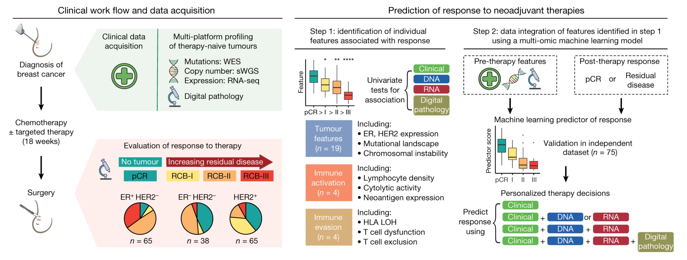
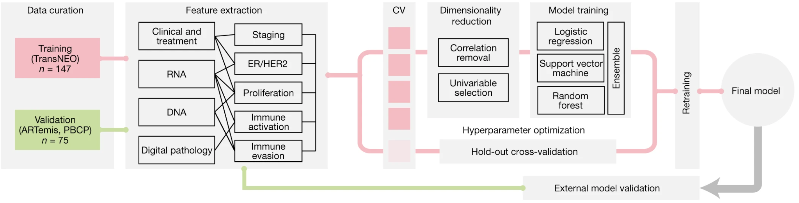
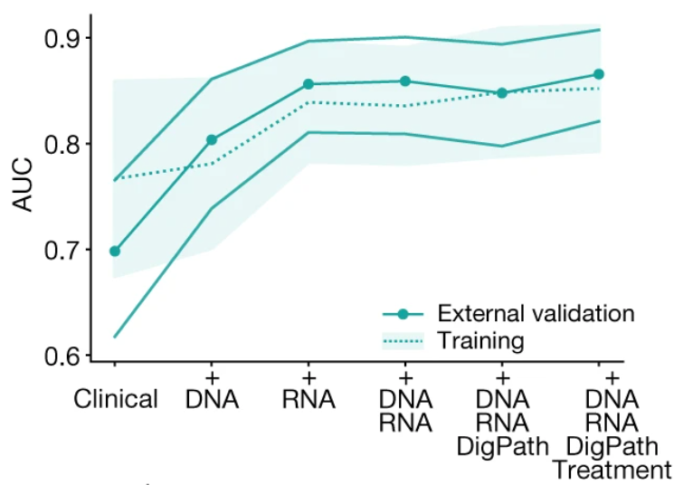

# Summary of  the study “Multi-omic machine learning predictor of breast cancer therapy response”

## Authors (@slack): Chairunnisa Amanda (@AmandaC), Bassam Elhamsa (@Bassam_Elhamsa), Anarghya Hegde (@AnuHegde), Chioma Onyido (@Omabekee)
## Link to video: https://bit.ly/3ZbM37h

## Introduction
Therapy responses for breast cancer are influenced by the tumour ecology. Machine learning and multi-omic profiling improves personalised therapeutic strategies and response prediction. This study is aimed at identifying which tumour would react better to therapy and why. 

<figure>
  
  <figcaption>Figure 1: Overview of the study design</figcaption>
</figure>

Pre-therapy breast tumours from 168 patients were profiled using DNA and RNA sequencing and digital pathology analysis. After patients underwent chemotherapy for about 18 weeks, findings revealed that 26% of patients had pathological complete response (pCR), while other patients had remaining cancer in varied degrees.

## Key Biological Features Identified
They found that tumours attaining pCR had more neoantigens, higher mutation burdens and fewer subclonal mutations. Additionally, aggressive subtypes with higher pCR rates included TP53 and triple-negative mutant tumours. Loss of HLA class I genes increased the incidence of residual disease and decreased treatment response by impeding the presentation of neoantigens.

Tumours accomplishing pCR were found to over-express genes such as EGFR, CDKN2A and MYC whereas the tumours with residual disease had down-regulated immune pathways and epithelial-to-mesenchymal transition. Immunological signatures and tumour proliferation especially in lymphocytes were found to be correlated with pCR in case of HER2- tumours. Though certain immune dysfunctional tumours continue to be resistant to therapy, this illustrates the collective effect of an active immune microenvironment and rapid proliferation in determining treatment sensitivity and outcome prediction.

## Multi-omics integration and machine learning prediction of treatment response
To predict the pCR to breast cancer therapy, six ensemble machine learning models were developed with different feature sets - clinical, molecular and digital pathology data incorporated (Figure 2). An external cohort of 75 patients yielded the highest accuracy (AUC 0.87) for the fully integrated model (Figure 3). Immune activity, gene expression, proliferation, lymphocyte density and age were top predictive features.

<figure>
  
  <figcaption>Figure 2: Schematic of the machine learning framework</figcaption>
</figure>

<figure>
  
  <figcaption>Figure 3: AUCs for models obtained from the external validation cohorts</figcaption>
</figure>

## Conclusion
Although individual breast cancer features fail to make effective pCR prediction, a machine learning model integrative of all features accomplishes the possible accuracy, indicating the significance of comprehensive data in predicting therapy response.

## References
This summary is based on the original paper titled **'Multi-Omic Machine Learning Predictor of Breast Cancer Therapy Response,'** authored by Sammut, S. J., Crispin-Ortuzar, M., Chin, S. F., Provenzano, E., Bardwell, H. A., Ma, W., ... & Caldas, C. (2022) and published in Nature (601(7894), 623-629). Available at [https://doi.org/10.1038/s41586-021-04278-5](https://doi.org/10.1038/s41586-021-04278-5)
