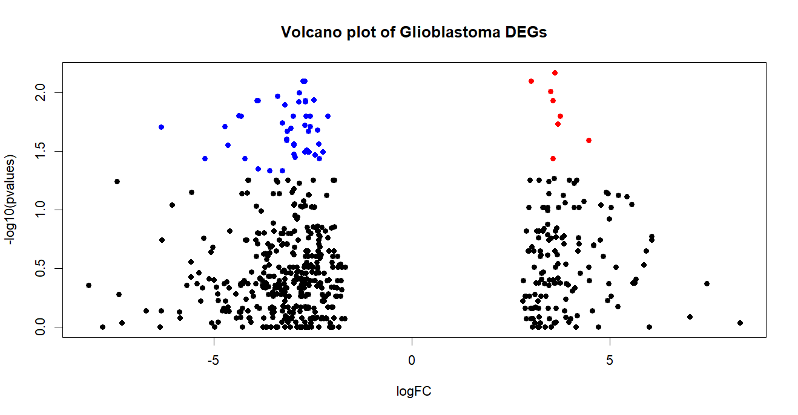
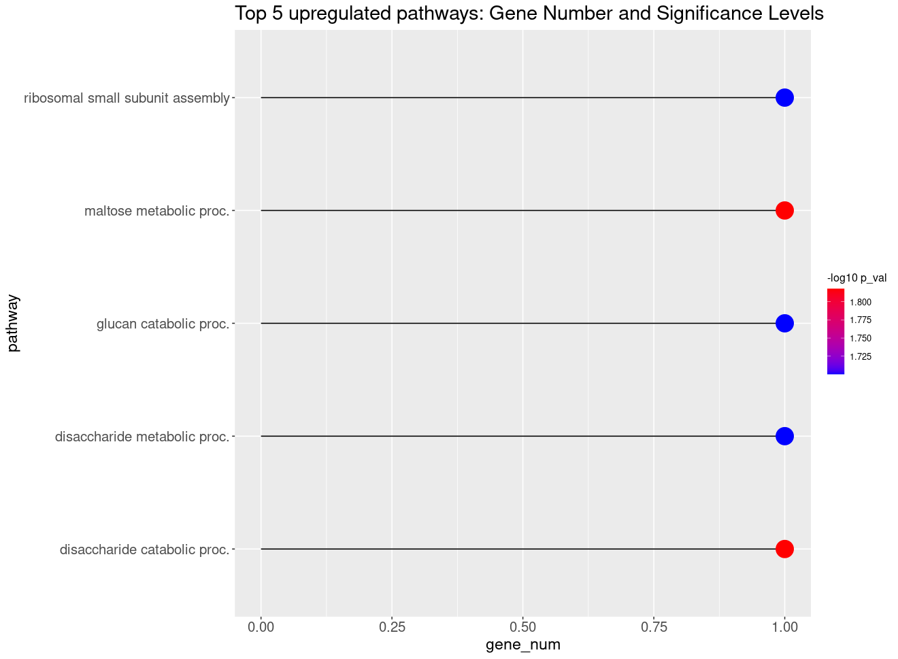

# Gene Expression Analysis and Visualisation of Glioblastoma Data

### Authors (@slack): Chairunnisa Amanda (@AmandaC), Bassam Elhamsa (@Bassam\_Elhamsa), Chioma Onyido (@Omabekee), Chukwuemeka Nwachuya (@Emzy247), Emmanuel Afolayemi (@EA(NOVACHRONO)), Hayford Osei Offei (@Hayford72), Ibrahim Fangary (@IbrahimFangary)

### GitHub Code: https://bit.ly/3XIVABC

## 1\. Introduction

This report covers gene expression analysis, visualisation and interpretation using the expression profiles of glioblastoma samples, where each value shows a gene's expression level in a specific sample.

## 2\. Heatmap Visualisation and the Importance of Colour Palettes in Gene Expression Analysis

Heatmaps were used to visualise gene expression levels across samples, highlighting upregulated and downregulated genes. Two colour palettes, diverging and sequential, were used to aid interpretation.

### 2.1 Diverging Colour Palette

The diverging palette shows high (brown) and low (blue) expression values, with a neutral colour (white) in the middle, making it easy to see contrasts between upregulated and downregulated genes across samples.

<figure>  
    
  <figcaption>Figure 1: Gene expression diverging heatmap</figcaption>  
</figure>

### 2.2  Sequential Color Palette  
The sequential palette as displayed in Figure 2 showed a gradient of values, making it easier to identify subtle differences in gene expression. They are also useful for visualising the increasing levels of gene expression activity across samples.

<figure>  
    
  <figcaption>Figure 2: Gene expression sequential heatmap</figcaption>  
</figure>

### 2.3 Clustering Methods in the Heatmap

Heatmaps were created using three different clustering methods: clustering by genes (rows), clustering by samples (columns) and clustering by both genes and samples (rows and columns) (Zhao *et al*., 2014\). 

<figure>  
    
  <figcaption>Figure 3: Clustering by genes heatmap</figcaption>  
</figure>

&nbsp;

<figure>  
    
  <figcaption>Figure 4: Clustering by samples heatmap</figcaption>  
</figure>

&nbsp;

<figure>  
    
  <figcaption>Figure 5: Clustering by genes and samples heatmap</figcaption>  
</figure>

## 3\. Identification of Significant Genes

Samples were grouped into two based on heatmap clusters for analysis (Figure 1). 

### 3.1 Calculate Fold Change (FC) and P-value

**Fold change** was calculated using the formula:   
log2FC \= log2(groupB\_mean+0.5) \- log2(groupA\_mean+0.5)  
(*0.5 was added to the log2 mean of each group to avoid inf results*).

**p-value** was calculated using the formula:  
pvalue \= wilcox.test (mean gene counts in groupA, mean gene counts in groupB)  
(*Wilcoxon test* (Neuhäuser, 2011\) *was used for this analysis because it handles non-parametric data well*).

**Cut-offs:** fold change ( \> 1.5 and \< \-1.5), and a p-value (0.05).

<figure>  
    
  <figcaption>Figure 6: Volcano plot showing the significant genes</figcaption>  
</figure>

## 4\.  Functional Enrichment Analysis

Next, ShinyGO (Ge et al., 2020\) was used to identify key  pathways enriched in the upregulated genes. 

<figure>  
    
  <figcaption>Figure 7: Key Pathways and Biological Processes Associated With Upregulated Genes</figcaption>  
</figure>

## 5\. Visualisation of Top 5 Upregulated Pathways

The top 5 upregulated pathways were visualised using a lollipop plot, showing the number of associated genes and scaled by the \-log10 of the p-value to indicate pathway significance.

<figure>  
    
 <figcaption>Figure 8: Top 5 Enriched Pathways Associated with Upregulated Genes</figcaption>  
</figure>

### 5.1 Biological Significance of Top 3 Enriched Pathways

**1\. Maltose Metabolic Process:** Cancer cells can use maltose (converted to glucose) for energy, driving proliferation and other processes, which may significantly impact glioma progression by promoting tumour growth and invasion (Hanahan & Weinberg, 2011).

**2\. Disaccharide Catabolic Process**: Glioblastoma cells can break down disaccharides like maltose into glucose for energy, aiding their survival in tumour environments (Hanahan & Weinberg, 2011; Navarro et al., 2022).

**3\. Disaccharide Metabolic Process**: Cancer cells are known for their reliance on glucose, and glioblastoma cells use disaccharide breakdown to sustain their energy (Lea & desBordes, 2020; Nguyen *et al*., 2022).

## REFERENCES

1. Ge, S. X., Jung, D., & Yao, R. (2020). ShinyGO: A graphical gene-set enrichment tool for animals and plants. *Bioinformatics*, *36*(8), 2628–2629. [https://doi.org/10.1093/bioinformatics/btz931](https://doi.org/10.1093/bioinformatics/btz931)

2. Hanahan, D., & Weinberg, R. A. (2011). Hallmarks of cancer: the next generation. cell, 144(5), 646-674.

3. Lea, M. A., & desBordes, C. (2020). Maltose enhanced the growth of bladder and colon cancer cells unlike some other disaccharides: Cellobiose, isomaltose, lactose, and sucrose. Cancer Research, 80(16\_Supplement), 227-227.

4. Navarro, C., Ortega, Á., Santeliz, R., Garrido, B., Chacín, M., Galban, N., ... & Bermúdez, V. (2022). Metabolic reprogramming in cancer cells: emerging molecular mechanisms and novel therapeutic approaches. Pharmaceutics, 14(6), 1303.

5. Nguyen, T. T., Shang, E., Westhoff, M. A., Karpel-Massler, G., & Siegelin, M. D. (2022). Therapeutic drug-induced metabolic reprogramming in glioblastoma. Cells, 11(19), 2956.

6. Neuhäuser, M. (2011). Wilcoxon–Mann–Whitney Test. In M. Lovric (Ed.), *International Encyclopedia of Statistical Science* (pp. 1656–1658). Springer. https://doi.org/10.1007/978-3-642-04898-2\_615

7. Zhao, S., Guo, Y., Sheng, Q., & Shyr, Y. (2014). Advanced Heat Map and Clustering Analysis Using Heatmap3. *BioMed Research International*, *2014*, 986048\. https://doi.org/10.1155/2014/986048

