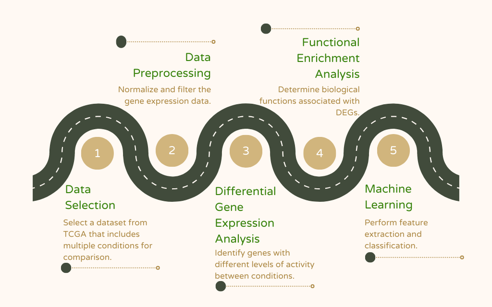

## Integrating Machine Learning and Differential Expression Analysis to Identify Key Biomarkers in Lymphoid Leukemia: Pathways, Predictions and Future Directions

This project involves the identification of key biomarkers associated with primary and recurrent lymphoid leukemia (LL) samples, using differential gene expression analysis (DGE) and machine learning (Random forest). The analysis was performed by the OncoHackers team using several R libraries for data preprocessing, visualization, DGE analysis and ML classification.

---

### **Libraries Used**

1. **tidyverse**: A collection of R packages for data manipulation, organization and visualization.  
2. **cowplot**: for combining multiple plots into a single figure, enhancing visual presentations.  
3. **randomForest**: for implementing random forest algorithms for classification and regression in ML tasks.  
4. **TCGAbiolinks**: for accessing and analyzing data from The Cancer Genome Atlas (TCGA) for bioinformatics research.  
5. **caret**: for streamlining the process of training ML models, including cross-validation and tuning.  
6. **DOSE**: for performing disease ontology-based enrichment analysis, useful for interpreting gene expression results.  
7. **forcats**: makes it easier to work with categorical variables (factors) in R.  
8. **enrichplot**: for visualizing functional enrichment analysis results, such as Gene Ontology (GO) and pathway data.  
9. **clusterProfiler**: for statistical analysis and visualization of functional profiles for genes and gene clusters.  
10. **org.Hs.eg.db**: gene annotation package which provides mappings between human gene IDs and biological information.  
11. **AnnotationDbi**: for linking different annotation databases with R objects for easier access and usage. 
12. **EnhancedVolcano**: for generating enhanced volcano plots to visualize differential gene expression analysis.  
13. **ggplot2**: for creating custom, high-quality visualizations in R using a layered approach.  
14. **FactoMineR**: for conducting multivariate data analysis, including PCA and clustering.  
15. **factoextra**: for providing tools for visualizing multivariate data analyses, such as PCA and clustering.  
16. **biomaRt**: for querying BioMart databases (such as Ensembl) for retrieving gene annotations.  
17. **dplyr**: for data manipulation tasks like filtering, selecting, and summarizing data.  
18. **readr**: for reading and writing tabular data more efficiently.  
19. **EDASeq**: for normalizing and adjusting RNA-Seq data for sequencing depth and gene length.  
20. **SummarizedExperiment**: for managing experimental datasets with metadata and matrix-based assay data.

**Code:** To install packages, use `install.packages(“packagename”)`  
To load libraries after installation, use `library(packagename)` 

---

### Analysis Workflow

<figure>  
    
  <figcaption>Figure 7: Biomarker Discovery Roadmap</figcaption>  
</figure>

The analysis workflow, including all steps, detailed methodology,  data preprocessing and results, are comprehensively documented within the [project report](https://github.com/Omabekee/hackbio-cancer-internship/blob/main/Stage-3/report/DGE-ML-for-biomarker-discovery.md).

---

### Biological Significance of Top Dysregulated Genes
In our analysis, we identified three key genes linked to lymphoid leukemia: AKR1C3, ARHGEF11, and AHNAK.

**AKR1C3** is known to play a role in steroid metabolism and inflammation, and its high levels are connected to resistance to chemotherapy in T-cell Acute Lymphoblastic Leukemia (T-ALL). It also affects immune pathways like neutrophil chemotaxis, making it a possible target for therapy (Reddie _et al_., 2022).

**ARHGEF11** helps control immune cell movement and is tied to natural killer (NK) cell activity. This gene could be a useful prognostic marker, particularly for immune responses in leukemia treatment (Park _et al_., 2022).

**AHNAK** is involved in calcium signaling and immune cell migration. Its elevated expression is associated with relapse in T-ALL, and it plays a role in immune surveillance, making it a potential target for therapies (Chiaretti _et al_., 2004).

Together, these genes provide insight into immune responses and treatment resistance, highlighting their potential for further leukemia research.

---

### Directory Structure

**/code**: This directory contains all the R codes used for analysis for each step in the workflow.

**/data**: In this folder, you will find the .csv format of the gene expression data downloaded from TCGA.

**/figures**: This directory holds the figures generated during the analysis, including the volcano plot, confusion matrix and lollipop plots of the top pathways.

**/ouput**: The output directory contains results from the project such as .csv files of the filtered significant genes obtained after analysis.

**/report**: This is where you’ll find the project report documenting the steps, methodology and interpretations of the analysis.

---

### Contributors (SlackID)
1. **Chioma Onyido**: Omabekee
2. **Chairunnisa Amanda**: AmandaC
3. **Bassam Elhamsa**: Bassam_Elhamsa
4. **Chukwuemeka Nwachuya**: Emzy247
5. **Ibrahim Fangary**: IbrahimFangary
6. **Emmanuel Afolayemi**: EA(NOVACHRONO)
7. **Hayford Osei Offei**: Hayford72
8. **Oluwatobi Ogundepo**: Oluwatobi

Please reach out to any the contributors if you've any questions.

---

### References
1. Chiaretti, S., Li, X., Gentleman, R., Vitale, A., Vignetti, M., Mandelli, F., Ritz, J., & Foa, R. (2004). Gene expression profile of adult T-cell acute lymphocytic leukemia identifies distinct subsets of patients with different response to therapy and survival. Blood, 103(7), 2771–2778. https://doi.org/10.1182/blood-2003-09-3243
2. Park, H., Kang, S., Kim, I., Kim, S., Kim, H.-J., Shin, D.-Y., Kim, D.-Y., Lee, K.-H., Ahn, J.-S., Sohn, S.-K., Lee, J.-O., Cheong, J.-W., Kim, K. H., Kim, H.-G., Kim, H., Lee, Y. J., Nam, S.-H., Do, Y. R., Park, S.-G., … Park, S. (2022). The association of genetic alterations with response rate in newly diagnosed chronic myeloid leukemia patients. Leukemia Research, 114, 106791. https://doi.org/10.1016/j.leukres.2022.106791
3. Reddi, D., Seaton, B. W., Woolston, D., Aicher, L., Monroe, L. D., Mao, Z. J., Harrell, J. C., Radich, J. P., Advani, A., Papadantonakis, N., & Yeung, C. C. S. (2022). AKR1C3 expression in T acute lymphoblastic leukemia/lymphoma for clinical use as a biomarker. Scientific Reports, 12(1), 1–8. https://doi.org/10.1038/s41598-022-09697-6

