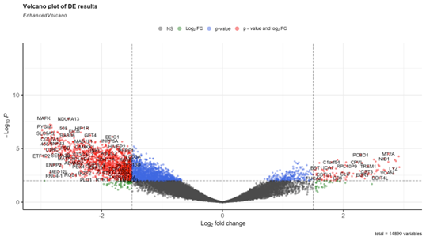
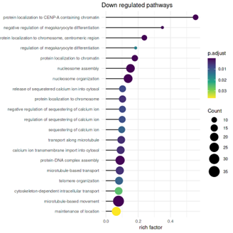
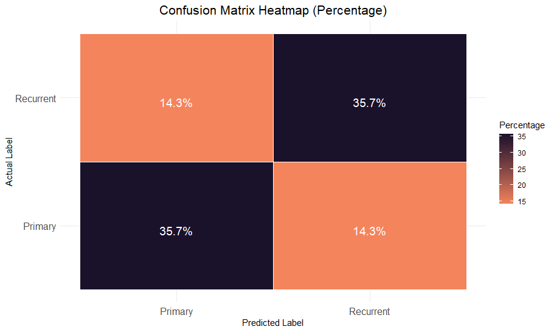
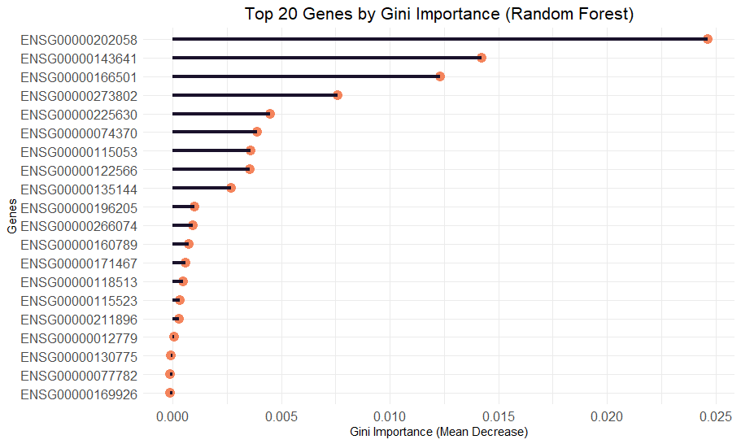

# Integrating Machine Learning and Differential Expression Analysis to Identify Key Biomarkers in Lymphoid Leukemia: Pathways, Predictions and Future Directions

### Authors (@slack): Chairunnisa Amanda (@AmandaC), Bassam Elhamsa (@Bassam\_Elhamsa), Chioma Onyido (@Omabekee), Chukwuemeka Nwachuya (@Emzy247), Emmanuel Afolayemi (@EA(NOVACHRONO)), Hayford Osei Offei (@Hayford72), Oluwatobi Ogundepo (@Oluwatobi)

#### GitHub Code: [https://bit.ly/3zBAjAC](DGE-ML-biomarker R Script)

## 1. Introduction to Lymphoid Leukemias

Lymphoid leukemias (LL) are blood cancers resulting from the abnormal growth of lymphoid cells- B, T, or NK cells. They are categorised into acute lymphoblastic leukaemia (ALL), common in children, and chronic lymphocytic leukaemia (CLL), which affects adults (Futami & Corey, 2010).

<figure>  
    
  <figcaption>Figure 1: AI-generated image showing the transition from primary to recurrent lymphoid leukemia, the progression of healthy cells to cancerous ones and their recurrence after treatment</figcaption>  
</figure>

### 1.1 Project Aim:

To identify the key biomarkers associated with primary and recurrent LL samples using differential gene expression analysis and machine learning.

## 2. Description of dataset and Data preprocessing steps

The data was downloaded from The Cancer Genome Atlas (TCGA) database via the GDC data portal. We selected 25 primary and 25 recurrent samples for analysis.

### 2.1 Handling missing values

The LL dataset was preprocessed by checking for missing or blank values using the `is.na` function, to reduce redundancies and understand what is unexpressed/undetected in our data.

### 2.2 Normalisation and Filtering

Normalisation and filtering were performed using the `TCGAnalyze_Normalization`, `TCGAnalyze_Filtering` and `betweenlaneNormalization` functions from the TCGAbiolinks and EDASeq R packages to adjust for gene length and sequencing depth.

## 3. Methodology for biomarker discovery

### 3.1 Differential gene expression analysis (DGE)

The analysis was conducted using the `TCGAanalyze_DEA` function from the TCGAbiolinks R package. Comparison was made between "primary" and "recurrent" samples, filtering results by an adjusted p-value < 0.05 and log2 fold change > 1.

<figure>  
    
  <figcaption>Figure 2:  Volcano plot showing the significant genes between primary and recurrent LL samples</figcaption>  
</figure>

### 3.2 Functional enrichment analysis

Functional enrichment was performed on 104 upregulated and 1,305 downregulated genes using the `enrichGO` function in R.

### 3.3 Pathway visualisation

The steps involved filtering pathways based on p-value and q-value, calculating the gene ratio and rich factor for each pathway, and visualising the top 20 enriched pathways using `ggplot`. 

<figure>  
    
  <figcaption>Figure 3:  Key Pathways and Biological Processes Associated With Upregulated Genes</figcaption> 
</figure>

<figure>  
    
  <figcaption>Figure 4:  Key Pathways and Biological Processes Associated With Downregulated Genes</figcaption> 
</figure>

## 4. Methodology for Machine learning analysis

### 4.1 Feature Extraction

After performing differential gene expression analysis, genes were filtered by selecting those with a LogFC > 1 and adjusted p-values < 0.05 which reduced the total number of genes from **14,898** to **1,502**. Subsequently, near-zero variance filtering was applied with no genes removed. Finally, to avoid collinearity, genes with a correlation higher than 80% were removed, resulting in 364 genes.

### 4.2 Model Training and Testing.

A random forest classification model was built to classify sample type—either primary or recurrent— using the feature-selected training dataset consisting of 364 genes and 20 samples (10 primary and 10 recurrent). The model was configured with 500 trees in the forest (`ntree = 500`) and 27 genes considered at each split (`mtry = 27`). Model testing and validation were performed on an independent set of 10 samples (5 primary and 5 recurrent).

## 5. Result and Interpretation of model performance

After the analysis, the model achieved a prediction accuracy of 80%. Out of the 10 samples used for the testing, the model accurately predicted 4/5 Primaries and 4/5 Recurrent cancer samples

<figure>  
    
  <figcaption>Figure 5:  Confusion matrices (CM) summarising the performance of the model on the test data to give insight into the precision of the classification approach</figcaption> 
</figure>

<figure>  
    
  <figcaption>Figure 6:  Top 20 genes by gini importance that helped the model performance</figcaption> 
</figure>

## 6. Conclusion and Future Directions for Research

This project combined machine learning and differential expression analysis to identify key biomarkers in LL. Through DEG and functional enrichment analysis, we were able to identify the molecular changes between the two stages- primary and recurrent. The analysis revealed important genes like AKR1C3, ARHGEF11 and AHNAK which show potential as therapeutic and diagnostic biomarkers for early detection and more effective therapies. Although our random forest classifier achieved 80% prediction accuracy, some primary and recurrent samples were misclassified, indicating areas for improvement.  
Future directions include refining the model for higher accuracy, expanding sample sizes and integrating additional data types to provide a more comprehensive understanding of LL.

## References

1. Futami, M., & Corey, S. J. (2010). Signaling Targets in Lymphoid Leukemias. In *Handbook of Cell Signaling* (pp. 2831–2835). Elsevier. [https://doi.org/10.1016/B978-0-12-374145-5.00328-4](https://doi.org/10.1016/B978-0-12-374145-5.00328-4)  
2. Mounir, M., Lucchetta, M., Silva, T. C., Olsen, C., Bontempi, G., Chen, X., ... & Papaleo, E. (2019). New functionalities in the TCGAbiolinks package for the study and integration of cancer data from GDC and GTEx. *PLoS computational biology*, *15*(3), e1006701.  
   
