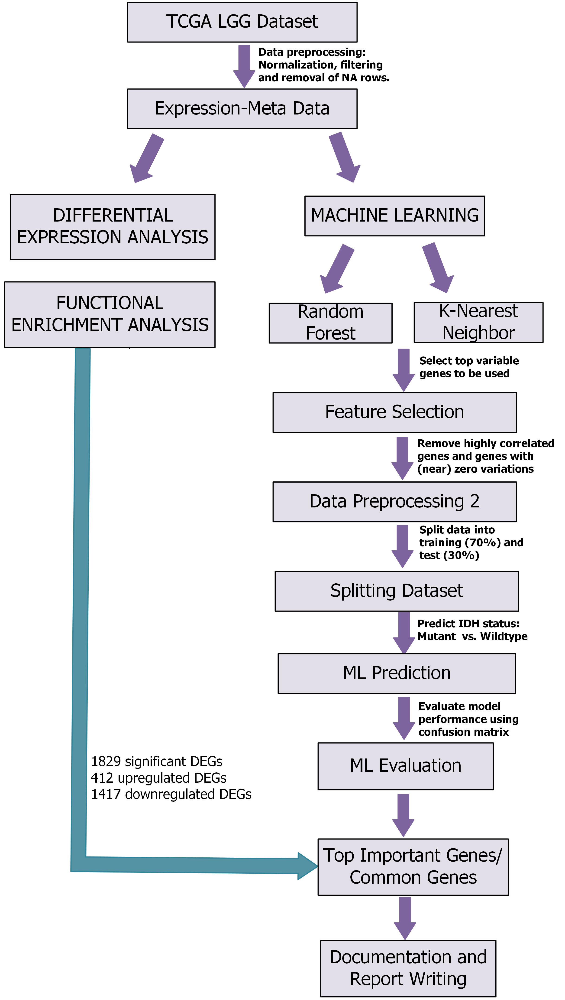
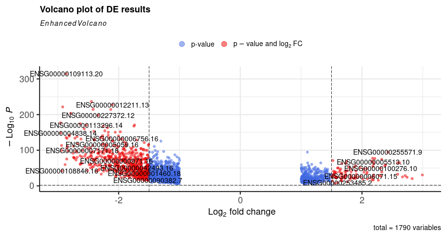
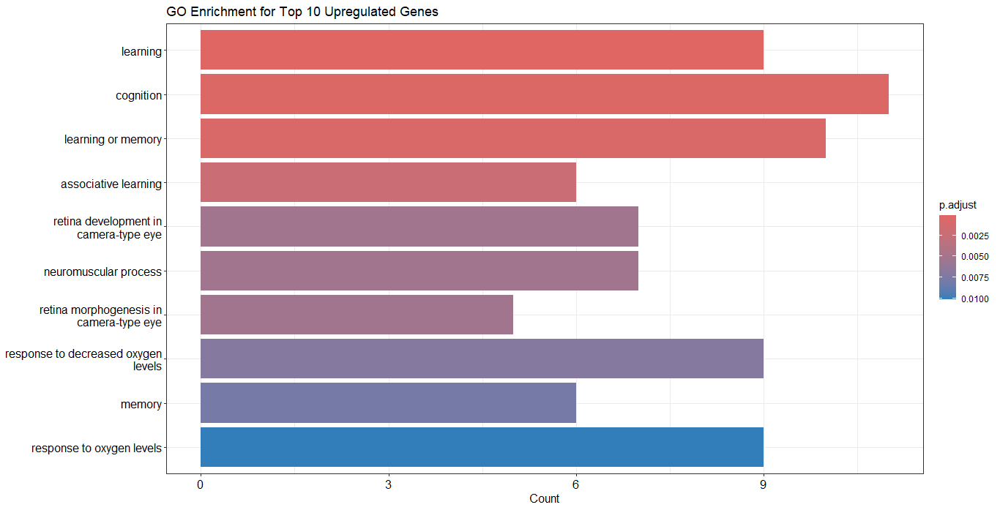
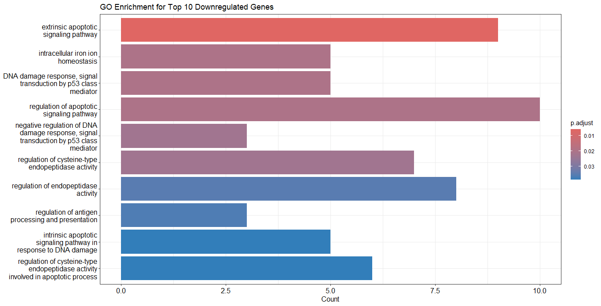
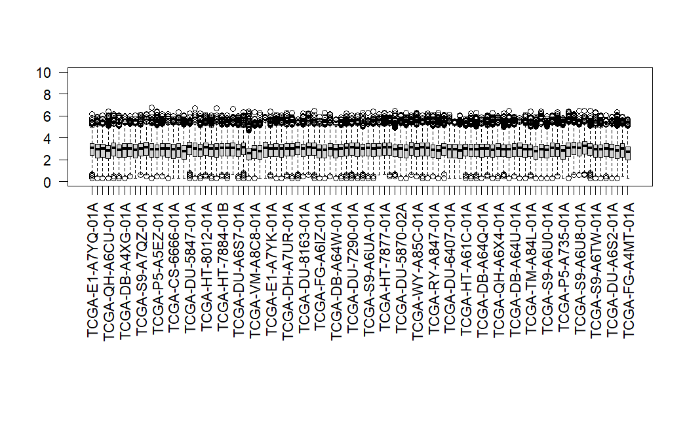
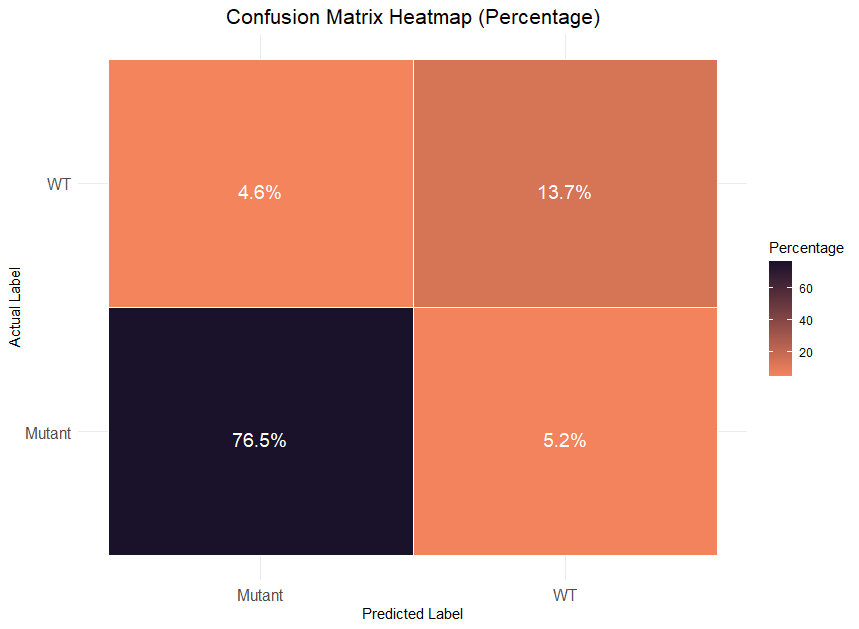
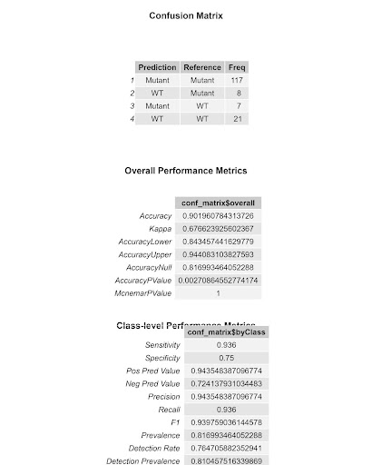
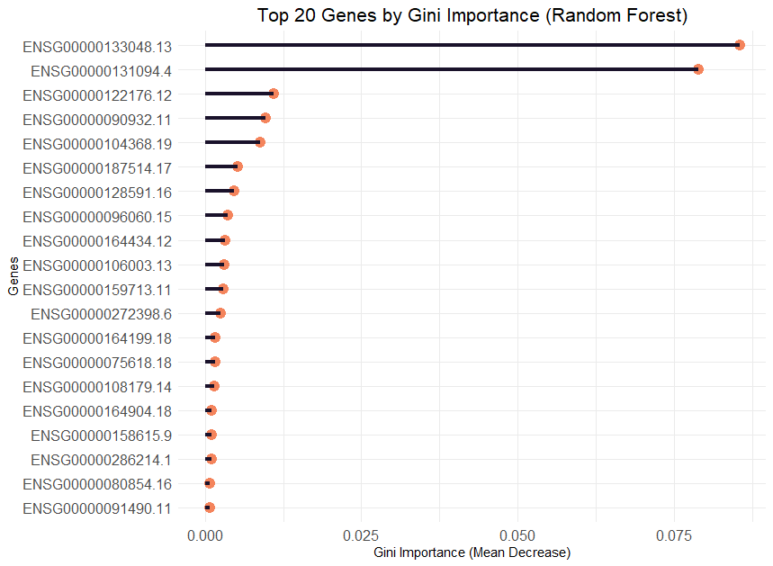
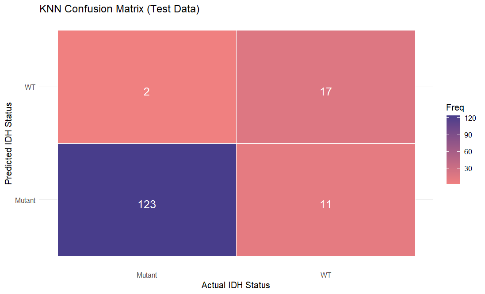
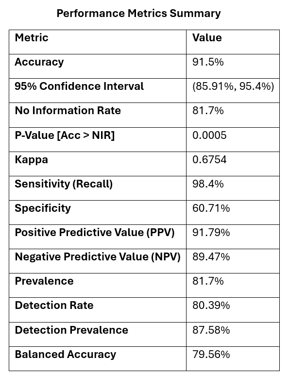

# Biomarker Discovery and IDH Status Classification in Low-Grade Gliomas Using Differential Gene Expression and Machine Learning Models

### Authors (@slack): Chairunnisa Amanda (@AmandaC), Bassam Elhamsa (@Bassam_Elhamsa), Chioma Onyido (@Omabekee), Chukwuemeka Nwachuya (@Emzy247), Emmanuel Afolayemi (@EA(NOVACHRONO)), Hayford Osei Offei (@Hayford72), Oluwatobi Ogundepo (@Oluwatobi), Ibrahim Fangary (@ibrahimfangary)

#### GitHub Code: [lgg.classification.R](https://github.com/Omabekee/hackbio-cancer-internship/blob/main/Stage-4/code/lgg-classification.R)

---

## Table of Contents
1. [Introduction](#1-introduction-to-low-grade-glioma)
2. [Dataset and Data Preprocessing](#2-description-of-dataset-and-data-preprocessing-steps)
3. [Methodology for Biomarker Discovery](#3-methodology-for-biomarker-discovery)
4. [Methodology for Machine Learning Analysis](#4-methodology-for-machine-learning)
5. [Result and Interpretation](#5-result-and-interpretation-of-model-performance)
6. [Conclusion and Future Directions for Research](#6-conclusion-and-future-directions-for-research)
7. [References](#references)

---

## 1. Introduction to Low-Grade Glioma

Low-Grade Gliomas (LGGs) are slow-growing brain tumors classified as Grade II gliomas by the World Health Organization (Ravanpay *et al*., 2018). Despite their slower growth, they can infiltrate brain tissue and progress to more aggressive forms. A key biomarker in LGG is the IDH mutation, which is associated with better prognosis, while IDH-wild type tumors tend to behave more aggressively (Solomou *et al*., 2023). 

### 1.1 Project Aim:

To identify key biomarkers linked to LGG samples using differential gene expression, enrichment analysis and machine learning. The objective is to predict IDH status and identify top genes of importance, which could aid in improving diagnosis and treatment outcomes.

<figure>  
    
  <figcaption>Figure 1: Analysis Workflow Highlighting Key Steps in LGG Analysis</figcaption>  
</figure>

## 2. Description of Dataset and Data Preprocessing Steps

The dataset consists of 534 Low-Grade Glioma (LGG) samples and corresponding IDH statuses obtained from the TCGA database (Ceccarelli _et al_., 2016)

### 2.1 Handling Missing Values

The LGG dataset was examined for missing values using the `is.na` function. Upon confirmation of the absence of missing values, the integrity of the dataset was established. This assessment ensured reliable data for subsequent analyses, thus supporting accurate clustering and classification of glioma IDH statuses.

### 2.2 Normalisation and Filtering

Normalization and filtering were performed using the `TCGAanalyze_Normalization`, `TCGAanalyze_Filtering`, and `betweenLaneNormalization` functions from the TCGAbiolinks and EDASeq R packages. These functions adjusted for gene length and sequencing depth, ensuring that expression levels were comparable across samples.

## 3. Methodology for Biomarker Discovery

### 3.1 Differential Gene Expression Analysis (DGE)

The analysis used the `TCGAanalyze_DEA` function from the TCGAbiolinks R package. The comparison was made between "mutant" and "wild type" samples, filtering results by false discovery rate cut of `0.01` and `log2 fold change > 1`.

<figure>  
    
  <figcaption>Figure 2: Volcano Plot Showing Significant Genes</figcaption> 
</figure>

### 3.2 Functional Enrichment Analysis

Functional enrichment was performed on 412 upregulated and 1,417 downregulated genes using the `TCGAanalyze_EAcomplete` function from the TCGAbiolinks R package.

### 3.3 Pathway Visualisation

 The top 10 statistically significant pathways identified from the functional enrichment analysis according to biological processes were visualised using the `TCGAvisualize_EAbarplot` function.

<figure>  
    
  <figcaption>Figure 3:  Key Pathways and Biological Processes Associated With Upregulated Genes</figcaption> 
</figure>

<figure>  
    
  <figcaption>Figure 4: Key Pathways and Biological Processes Associated With Downregulated Genes</figcaption> 
</figure>

## 4. Methodology for Machine learning 

### 4.1  Random Forest for Predicting IDH Status

After performing DGE, genes were filtered by selecting those with a LogFC > 1 and adjusted p-values < 0.01. To avoid collinearity, genes with a correlation higher than 80% were removed, resulting in 364 genes.

### 4.1.1   Model Training and Testing

A random forest classification model was built to classify mutation status—mutant or wildtype— using the feature-selected training dataset consisting of 123 genes and 360 samples. 100 genes considered at each split (`mtry = 100`). Model testing was performed on an independent set of 153 samples.

### 4.2  KNN for Predicting IDH Status
We built a K-Nearest Neighbors (KNN) model to predict IDH status (mutant or wildtype) based on gene expression across samples. After thorough data preprocessing, cleaning, and filtering, we applied the `topPreds` function to identify the top 1000 predictors with the highest standard deviation, which were then used to train the model.

<figure>  
    
  <figcaption>Figure 5: Boxplot After Log Transformation</figcaption> 
</figure>

###     4.2.1 Model Training and Testing

 The data was split into 70:30, resulting in 375 samples for training and 159 for testing. We used cross-validation (via the `ctrl.lgg` function) to ensure thorough sampling and reduce bias during training. The optimal value of k was determined using `knn.lgg$bestTune`, which identified the best `k = 1`.

## 5. Result and Interpretation of model performance

### 5.1 Performance of Random Forest Model

<figure>  
    
  <figcaption>Figure 6: Confusion Matrices Summarising the Performance of the Model</figcaption> 
</figure>

<figure>  
    
  <figcaption>Figure 7: Summary of Performance Metrics for Random Forest Model</figcaption> 
</figure>

<figure>  
    
  <figcaption>Figure 8: Top 20 Genes By Gini Importance</figcaption> 
</figure>

### 5.2 Performance of KNN Model

The model achieved a prediction accuracy of 91.5%. The model accurately predicted 123/125 IDH-Mutant and 17/28 IDH-WT LGG samples.

<figure>  
    
  <figcaption>Figure 9: Confusion Matrices Summarising Model Performance</figcaption> 
</figure>

<figure>  
    
  <figcaption>Figure 10: Summary of Performance Metrics for KNN Model</figcaption> 
</figure>

## 6. Conclusion and Future Directions for Research

This project combined machine learning and differential expression analysis to identify gene expression patterns associated with IDH mutation status in LGG. Top 3 genes identified were CHI31, C1QL1 and FMOD  which are associated with locomotory behavior, motor learning, apoptopic and inflammatory response. The KNN and Random Forest models achieved a prediction accuracy of 91.5% and 90.1% respectively, with few wild-type (WT) samples were misclassified, revealing areas for further refinement. Future directions include improving model accuracy through different machine learning algorithms and integrating additional data sources like proteomic data to improve diagnostics and tailored therapeutic strategies for LGG patients.

---

## References

1. Ceccarelli, M., Barthel, F. P., Malta, T. M., Sabedot, T. S., Salama, S. R., Murray, B. A., Morozova, O., Newton, Y., Radenbaugh, A., Pagnotta, S. M., Anjum, S., Wang, J., Manyam, G., Zoppoli, P., Ling, S., Rao, A. A., Grifford, M., Cherniack, A. D., Zhang, H., Poisson, L., … Verhaak, R. G. (2016). Molecular Profiling Reveals Biologically Discrete Subsets and Pathways of Progression in Diffuse Glioma. *Cell*, *164*(3), 550–563. https://doi.org/10.1016/j.cell.2015.12.028  
2. Ravanpay, A., Ko, A. L., & Silbergeld, D. L. (2018). Low-Grade Gliomas. In *Principles of Neurological Surgery* (pp. 573-579.e1). Elsevier. https://doi.org/10.1016/B978-0-323-43140-8.00038-X
3. Solomou, G., Finch, A., Asghar, A., & Bardella, C. (2023). Mutant IDH in Gliomas: Role in Cancer and Treatment Options. *Cancers*, *15*(11), 2883. https://doi.org/10.3390/cancers15112883
